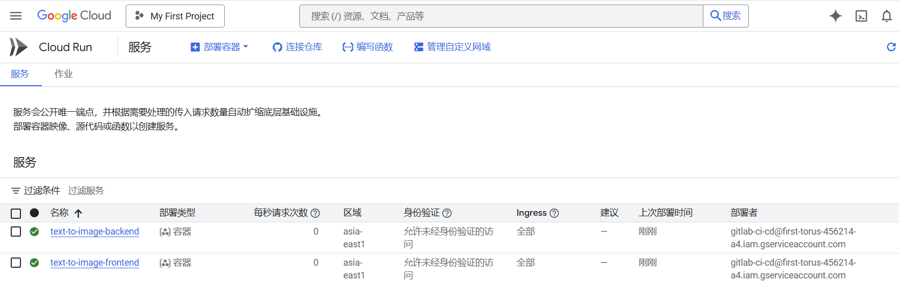
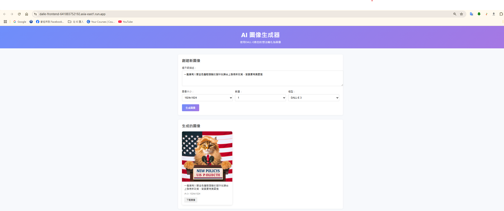

# 🖼️ Text-to-Image Generator

A full-stack project that takes text prompts and generates corresponding images using DALL-E model.

🚀 Deployed on **GCP Cloud Run** with a modern frontend interface and automated CI/CD via GitLab.

---

## 🌐 Give it a try!

👉 [Open the Text-to-Image App](https://text-to-image-frontend-641883752192.asia-east1.run.app/)

---

## 🖼️ Screenshots

### 🔧 GCP Cloud Run Deployment

> Application deployed via Docker on GCP Cloud Run:



---

### 💡 UI Demo

> Input your prompt and generate images with one click:



---

## ⚙️ Features

- ✍️ Text-to-Image generation using a backend LLM API model
- 🎨 Real-time frontend preview
- 🌩️ Cloud-native deployment (GCP Cloud Run + Docker)
- 🔁 Automated GitLab CI/CD pipeline
- 📦 RESTful API with FastAPI
- ⚛️ Modern frontend (React)

---

## 📦 Tech Stack

- **Backend**: Python, FastAPI, OpenAI API (DALL-E)
- **Frontend**: React (Vite), CSS
- **Cloud**: Docker, GCP Cloud Run, GCR
- **CI/CD**: GitLab CI/CD
- **Others**: Nginx

---

## 🔄 GitLab CI/CD Overview

This project uses **GitLab CI/CD** for continuous integration and deployment to GCP Cloud Run.

### 🛠️ Pipeline Stages

1. **Test**: Install dependencies and verify backend integrity
2. **Build**: Create Docker images and upload to Google Container Registry
3. **Deploy**: Deploy both frontend and backend to Cloud Run

---

## 🚀 Getting Started (Local)

### Backend (FastAPI)

```bash
cd app
pip install -r requirements.txt
uvicorn main:app --host 0.0.0.0 --port 8000
```

### Frontend (React)

```bash
cd frontend
npm install
npm start
```
